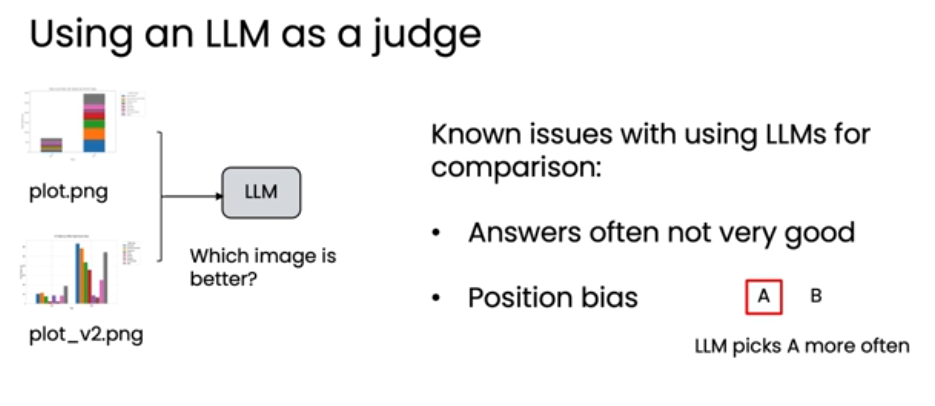

#  评估反思的影响 Evaluating the impact ofreflection
反思（Reflection）作为一种设计模式，能有效提升agent性能，但其代价是会略微拖慢agent速度。因此，关键在于如何科学地评估反思带来的实际收益，从而在“性能提升”与“效率损耗”之间做出明智取舍。

## 一、客观评估——数据查询任务

### 反思工作流

问题：“哪种颜色的产品总销量最高？”
- 基础流程：
  1. LLM 根据问题生成 SQL 查询语句（V1）。
  2. 执行 V1 查询，获取结果。
  3. LLM 根据结果回答问题。

- 反思增强流程：
  1. LLM 生成初始 SQL 查询（V1）。
  2. 新增反思步骤：另一个 LLM 对 V1 查询进行审视，并生成改进版的 SQL 查询（V2）。
  3. 执行 V2 查询，获取结果。
  4. LLM 根据结果回答问题。

### 构建评估数据集
为了评估反思的效果，需要创建一个包含“提示词”和“真实答案”的数据集。

| PROMPTS (提示词)                     | GROUND TRUTH ANSWER (真实答案) |
|--------------------------------------|-------------------------------|
| 2025年5月售出了多少商品？            | 1201                          |
| 库存中最贵的商品是什么？             | Airflow sneaker               |
| 我的店铺中有多少款式？               | 14                            |

**通过运行两个版本的工作流并比较结果，可以得出客观的性能指标。**

| PROMPTS (提示词) / 问题                     | GROUND TRUTH ANSWER (真实答案) | NO REFLECTION (无反思) | WITH REFLECTION (有反思) |
|--------------------------------------------|-------------------------------|------------------------|---------------------------|
| 2025年5月售出了多少商品？ Number of items sold in May 2025? | 1201                          | 980                    | 1201                      |
| 库存中最贵的商品是什么？ Most expensive item?             | Airflow sneaker               | Airflow sneaker        | Airflow sneaker           |
| 我的店铺中有多少款式？ How many styles carried?           | 14                            | 14                     | 14                        |

**结论：反思显著提升了数据库查询的质量和最终答案的准确率。虽然增加了计算开销，但其带来的性能提升（+8%）是“有意义的”（meaningfully improving），值得保留。**

### 迭代优化：调整提示词
一旦建立了评估机制，开发者就可以快速迭代：
- 修改“反思提示词”，例如要求模型让查询“更快”或“更清晰”。
- 或者修改“初始生成提示词”。
- 每次修改后重新运行评估，测量正确率的变化，从而选择最适合应用的提示词。

## 二、主观评估——可视化图表任务
- 任务：根据 coffee_sales.csv 数据生成 Q1 咖啡销售对比图。
- 问题：如何判断“反思后”的图表比“反思前”的图表更好？
- 难点：评估标准是主观的（如美观度、清晰度），而非黑白分明的客观标准。

### 直接让LLM做裁判的弊端
直观的想法是让 LLM 直接比较两张图并给出“哪个更好”。
已知问题：
  1. 答案不可靠：LLM 的评判结果往往不稳定。
  2. 位置偏见（Position bias）：许多模型倾向于选择第一个输入的选项（A），无论其质量如何。

 

### 使用评分表（Rubric）
更好的方法是为 LLM 提供一套结构化的评分标准（Rubric），让它对每个维度进行打分，而不是直接比较。
- 示例评分量表：
  1. 是否有清晰的标题？
  2. 坐标轴是否有标签？
  3. 图表类型是否合适？
  4. 坐标轴的数值范围是否恰当？
同样，可以构建一个包含多个用户查询的数据集，对“有反思”和“无反思”生成的图表分别打分。

 

## 三、评估反思的核心方法论
客观评估：
- 构建带“真实答案”的数据集，用代码自动计算正确率。
- 简单、易管理、结果客观。适用于有明确答案的任务（如数据库查询）。
主观评估：
- 使用 LLM 作为裁判，但需提供详细的评分量表（Rubric）。
- 需要更多调优，但能处理复杂的主观标准（如图表美观度）。

## 总结：
- 反思的价值：它是一种强大的工具，能显著提升输出质量，但需付出一定的性能代价。
- 评估是关键：不能凭感觉决定是否保留反思步骤，必须通过客观或结构化的主观评估来衡量其收益。
- 客观任务：用“真实答案”数据集 + 代码自动化评估。
- 主观任务：用“评分量表”引导 LLM 进行结构化打分，避免直接比较。
- 迭代优化：建立评估体系后，可以快速尝试不同的提示词，找到最优解。
- 未来方向：结合外部信息，是进一步提升反思效果的下一个前沿。

