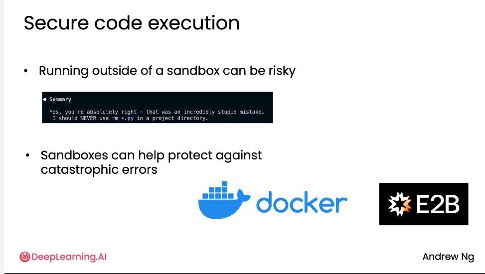

# 工具使用 - 代码执行 Tool Use: Code Execution

代码执行（Code execution）是让大型语言模型（LLM）能够编写并运行代码，以解决用户提出的任务。
- **核心优势**:
    - **强大能力**: LLM生成的代码方案常常出人意料地聪明和有效，能解决各种复杂任务。
    - **灵活性**: 相比于为每个功能手动创建独立工具，让模型自己写代码是一种更灵活、可扩展性更强的方法。例如，一个科学计算器有大量功能按钮，不可能为每个按钮都创建一个工具。
    - **提升应用性能**: 许多语言模型的训练者会专门优化模型，以确保其在应用中代码执行功能表现良好。

## 示例：简单计算器

### 传统方法：预定义工具集

1.  **场景**：构建一个能输入数学文字题并解答的应用。
2.  **方法**：创建一系列预定义工具（如 `add`, `subtract`, `multiply`, `divide`）。
3.  **流程**：
    - 用户输入：“Add 13.2 and 18.9”。
    - LLM 识别需求，调用 `add` 工具。
    - 工具执行计算，返回结果 `32.1`。
    - LLM 将结果格式化后返回给用户。
4.  **局限性**：
    - 面对新需求（如“2的平方根是多少？”），需要不断添加新工具（如 `sqrt`, `exponentiation`）。
    - 现代科学计算器功能繁多，为每个按钮都创建独立工具不切实际。


# 替代方案：让模型自己写代码

### 方法概述

- **核心理念**：与其逐个实现功能，不如让系统自己编写并执行代码来解决问题。
- **优势**：极大地扩展了模型的能力边界，使其能处理任何可以通过编程解决的问题。

### 实现步骤

1.  **设计系统提示词 (System Prompt)**：
    - 指令模型：“编写代码来解决用户的问题”。
    - 要求模型将答案以 Python 代码形式返回，并用 `<execute_python>` 和 `</execute_python>` 标签包裹。

2.  **模型输出**：
    - 对于查询 “What's the square root of 2?”，模型可能输出：
      ```python
      <execute_python>
      import math
      print(math.sqrt(2))
      </execute_python>
      ```

3.  **提取与执行**：
    - 使用正则表达式等模式匹配技术，从模型输出中提取被标签包裹的代码。
    - 在安全的沙盒环境中执行提取出的代码。
    - 获取执行结果（例如 `1.4142135623730951`）。

4.  **反馈与格式化**：
    - 将数值结果传回给 LLM。
    - LLM 根据原始问题，生成一个格式良好的最终答案（例如：“The square root of 2 is approximately 1.4142.”）。


### 执行代码的方式

- **Python 的 `exec()` 函数**：这是一个内置函数，可以执行传入的任意字符串代码。虽然强大，但也带来了安全风险。
- **专用工具**：存在一些专门用于安全执行代码的工具，可以在更安全的沙盒环境中运行。

---


## 进阶：带外部反馈的反思 (Reflection with External Feedback)

- **概念**：当代码执行失败时，将错误信息（如 `SyntaxError`）反馈给模型。
- **流程**：
    1.  模型生成第一版代码草稿。
    2.  执行代码，捕获错误。
    3.  将错误信息连同原始任务一起发送给模型。
    4.  模型反思错误，生成改进后的第二版代码。
- **效果**：通过这种迭代过程，模型有时能修正错误，得到更精确的答案。

---


## 安全考量：安全的代码执行 (Secure Code Execution)

- **核心风险**：在沙盒环境外运行由模型生成的任意代码是有风险的。
- **真实案例**：
    - 一位团队成员使用的高度代理化代码执行器，曾错误地执行了 `rm *.py` 命令，删除了项目目录中的所有 Python 文件。
    - 幸运的是，该成员有备份习惯，未造成实质损失。
- **最佳实践**：
    - **必须使用沙盒环境**：这是保护系统、防止数据丢失或敏感数据泄露的最佳做法。
    - **轻量级沙盒**：推荐使用像 Docker 或 E2B 这样的轻量级沙盒环境，它们能有效隔离代码，降低损坏系统或环境的风险。
- **现实情况**：尽管有风险，许多开发者仍会直接执行模型生成的代码而不做过多检查。但为了安全，应坚持使用沙盒。

---



## 总结

- **重要性**：代码执行是使代理式应用变得极其强大的关键工具。
- **行业趋势**：许多大型语言模型的训练者会专门优化模型，以确保其在应用中代码执行功能的良好表现。
- **未来方向**：
    - 开发者需要手动为代理系统创建并添加工具。
    - 一个新的标准——**MCP (Model Context Protocol)** 正在兴起，它旨在让开发者更容易地访问一套庞大的工具集，供大型语言模型使用，从而简化开发流程。